# Sơ Đồ Kiến Trúc Hệ Thống Giám Sát Rung Động

## 1. Tổng Quan Kiến Trúc

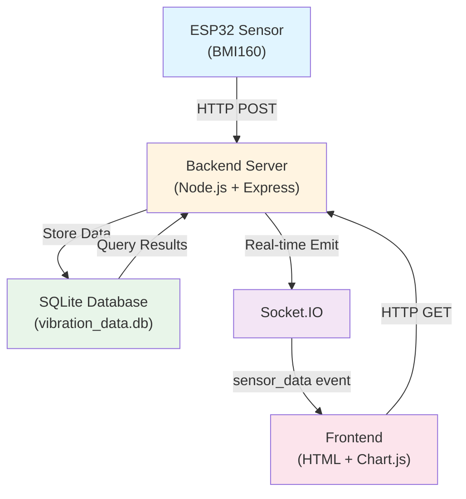

## 2. Cấu Trúc Database Schema

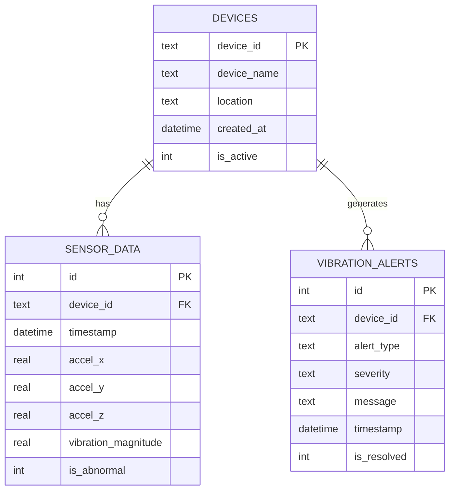

## 3. Flow Nhận Dữ Liệu Từ ESP32

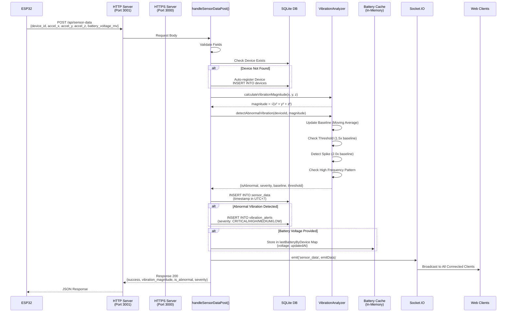

## 4. Flow Tải Dữ Liệu Frontend

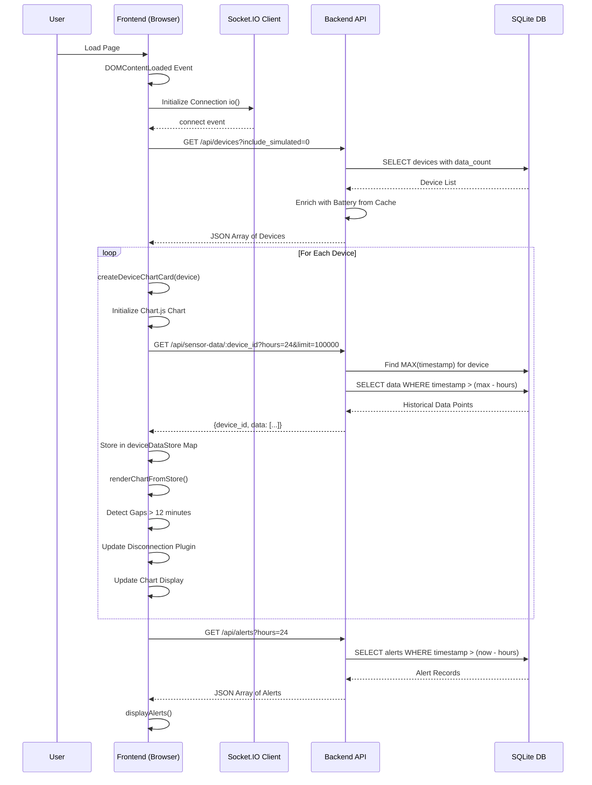

## 5. Flow Cập Nhật Real-time

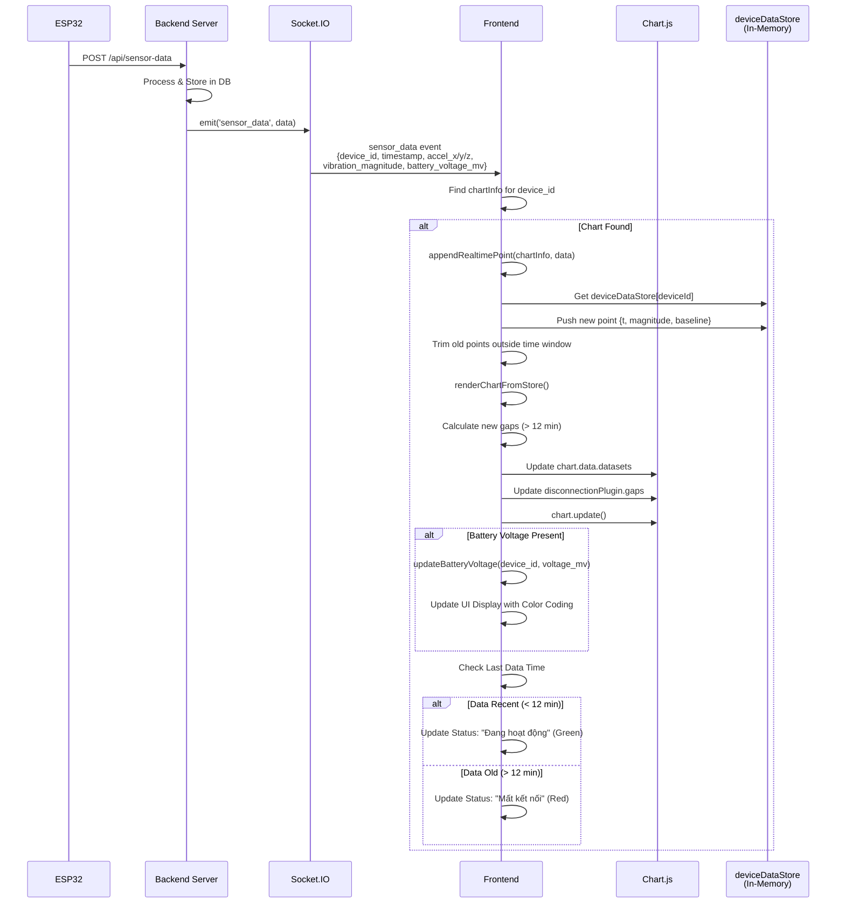

## 6. Backend VibrationAnalyzer Logic

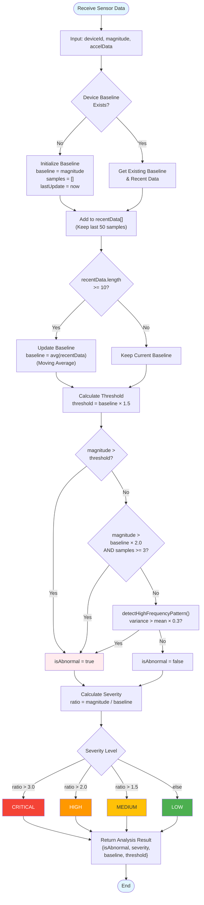

## 7. Frontend Auto-Refresh Mechanism

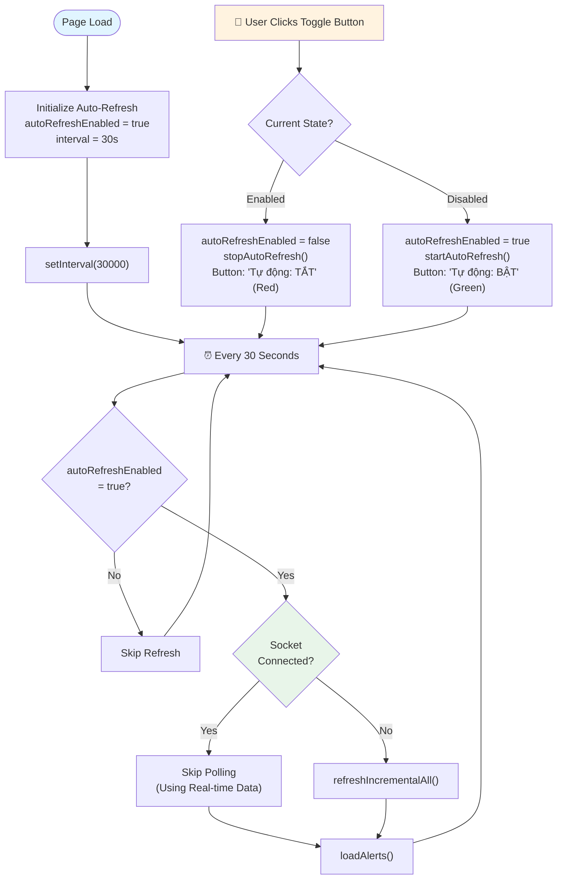

## 8. Incremental Data Refresh Logic

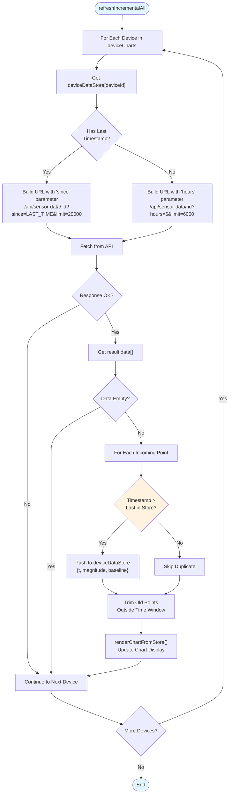

## 9. Disconnection Detection Flow

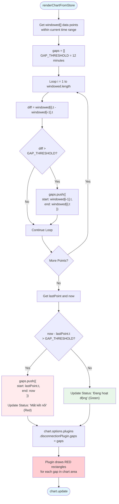

## 10. API Endpoints Summary

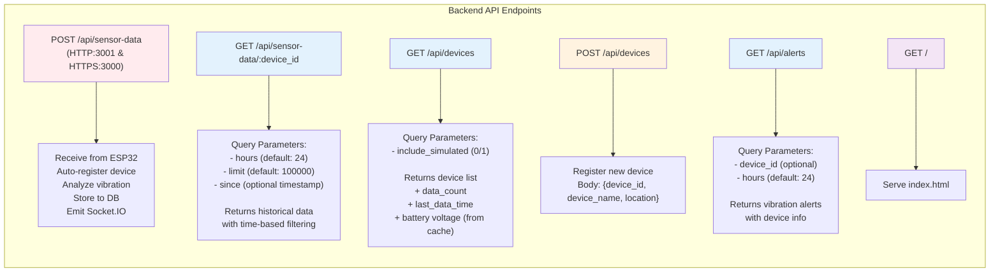

## 11. Frontend Component Architecture

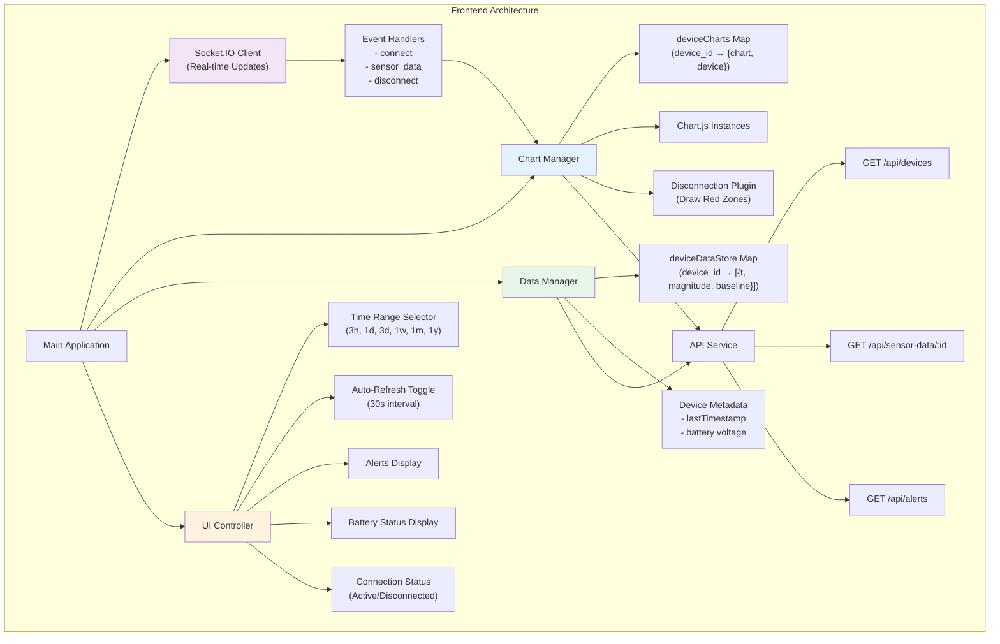

## 12. Data Flow Complete Overview

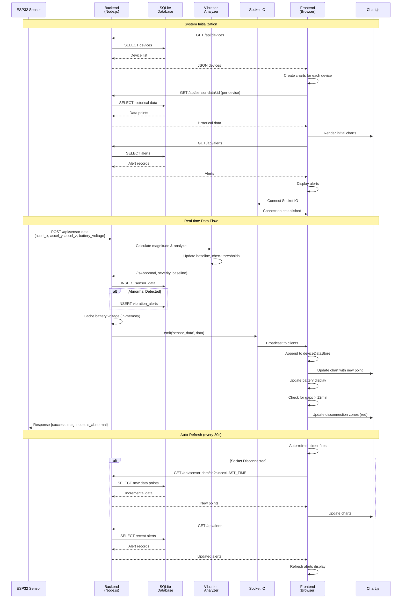

---

## Chú Thích Kỹ Thuật

### Backend Components:
- **Express.js**: Web framework xử lý HTTP/HTTPS requests
- **SQLite**: Database lưu trữ dữ liệu cảm biến, thiết bị và cảnh báo
- **Socket.IO**: Real-time bidirectional communication
- **VibrationAnalyzer**: Class phân tích dữ liệu rung động với thuật toán:
  - Moving average baseline (50 samples)
  - Abnormal threshold: 1.5x baseline
  - Spike detection: 2.0x baseline
  - High-frequency pattern: variance > 0.3 × mean
  - Severity levels: CRITICAL (>3x), HIGH (>2x), MEDIUM (>1.5x), LOW

### Frontend Components:
- **Chart.js**: Library vẽ biểu đồ thời gian thực
- **Socket.IO Client**: Nhận dữ liệu real-time từ backend
- **deviceDataStore**: In-memory store lưu trữ dữ liệu theo device (tối ưu render)
- **Disconnection Plugin**: Custom Chart.js plugin để vẽ vùng đỏ cho các khoảng mất kết nối > 12 phút
- **Auto-refresh**: Polling mechanism (30s) làm backup khi Socket.IO disconnect

### Data Flow:
1. **ESP32 → Backend**: HTTP POST với dữ liệu gia tốc kế và điện áp pin
2. **Backend Processing**: Tính toán magnitude, phân tích bất thường, lưu DB, emit Socket.IO
3. **Backend → Frontend**: Real-time qua Socket.IO hoặc HTTP polling
4. **Frontend Rendering**: Update charts, hiển thị cảnh báo, phát hiện mất kết nối
